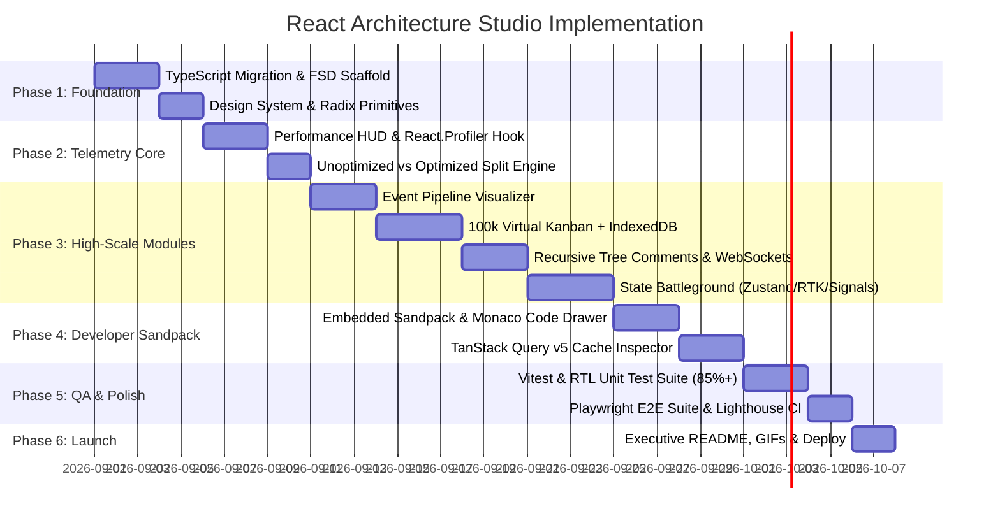

# 🚀 MASTER PLAN: React Architecture & Performance Studio
> **From Academic Practice Tasks to a Senior/Staff-Level Open-Source Benchmarking Engine**
> **Author**: Sanket Kedare  
> **Target Project**: [`React-Tasks`](https://github.com/sanketkedare/React-Tasks) ➔ `React Architecture & Performance Studio`  
> **Deployed Reference**: [`react-tasks-keh6.onrender.com`](https://react-tasks-keh6.onrender.com/)  
> **Version**: 1.0.0 (Master Blueprint)

---

## 📑 Table of Contents
1. [Executive Vision & Strategic Pivot](#1-executive-vision--strategic-pivot)
2. [Target Tech Stack & Infrastructure](#2-target-tech-stack--infrastructure)
3. [Design System & UI/UX Standards](#3-design-system--uiux-standards)
4. [Core Architectural Modules & Deep Features](#4-core-architectural-modules--deep-features)
   - [Module 1: Real-Time Performance Profiler HUD & Optimization Toggle](#module-1-real-time-performance-profiler-hud--optimization-toggle)
   - [Module 2: Event Pipeline & Concurrency Stream Visualizer](#module-2-event-pipeline--concurrency-stream-visualizer)
   - [Module 3: 100,000-Item Virtualized Kanban & Optimistic Mutation Engine](#module-3-100000-item-virtualized-kanban--optimistic-mutation-engine)
   - [Module 4: Recursive Infinite-Depth Comment Tree & Real-Time Sync](#module-4-recursive-infinite-depth-comment-tree--real-time-sync)
   - [Module 5: State Management Battleground (Zustand vs Redux vs Context vs Signals)](#module-5-state-management-battleground)
   - [Module 6: TanStack Query v5 Cache & Network Mutation Inspector](#module-6-tanstack-query-v5-cache--network-mutation-inspector)
   - [Module 7: Interactive In-Browser Code Sandbox (Sandpack / Monaco)](#module-7-interactive-in-browser-code-sandbox)
5. [Project Architecture (Feature-Sliced Design)](#5-project-architecture-feature-sliced-design)
6. [Testing & Quality Assurance Suite](#6-testing--quality-assurance-suite)
7. [CI/CD & DevOps Pipeline](#7-cicd--devops-pipeline)
8. [Phased Implementation Roadmap](#8-phased-implementation-roadmap)
9. [Resume & Portfolio Positioning](#9-resume--portfolio-positioning)

---

## 1. Executive Vision & Strategic Pivot

### The Problem with the Current State
The existing repository is a well-meaning academic collection of beginner tutorials (To-Do List, Tic-Tac-Toe, Password Generator, basic debouncing guns). To technical recruiters and engineering managers, this signals a junior/entry-level candidate.

### The Master-Level Solution
Transform the platform into an **interactive developer tool and architecture laboratory**. Instead of simply showing that code runs, the platform will **measure, visualize, profile, and benchmark React architectural trade-offs in real time**.

```
┌────────────────────────────────────────────────────────────────────────────────────────┐
│                        REACT ARCHITECTURE & PERFORMANCE STUDIO                         │
├───────────────────────────────┬───────────────────────────────┬────────────────────────┤
│     COMPLEX ARCHITECTURE      │     REAL-TIME TELEMETRY       │   IN-BROWSER SANDBOX   │
│  • 100k Virtualization        │  • React.Profiler metrics     │  • Monaco / Sandpack   │
│  • Concurrency & RAF stream   │  • Re-render flash counter    │  • Live parameter edit │
│  • State engine comparison    │  • FPS & JS Heap estimations  │  • Pattern rationale   │
└───────────────────────────────┴───────────────────────────────┴────────────────────────┘
```

---

## 2. Target Tech Stack & Infrastructure

| Layer | Technology | Rationale |
| :--- | :--- | :--- |
| **Core Framework** | **React 19 / 18 + TypeScript 5.x** | Strict typing (`strict: true`), zero `any`, generics, discriminated unions. |
| **Build Tooling** | **Vite 6** | Instant HMR, roll-up chunk optimization, sub-second build times. |
| **Styling & Design** | **Tailwind CSS + Radix UI Primitives** | Headless accessible components (a11y) with dark glassmorphic styling tokens. |
| **State Engines** | **Zustand, Redux Toolkit, React Context, Jotai/Signals** | Multi-engine comparison framework. |
| **Data Synchronization** | **TanStack Query v5 (React Query) + TanStack Virtual** | Server state caching, optimistic updates, 100k DOM node virtualization. |
| **Offline Persistence** | **Dexie.js / IndexedDB** | True client-side database storage with web worker background sync. |
| **In-Browser Sandbox** | **`@codesandbox/sandpack-react` / Monaco** | Live editable code snippets beside each pattern. |
| **Testing Suite** | **Vitest + React Testing Library + Playwright** | Unit tests for custom hooks, integration tests for trees, and E2E visual tests. |
| **CI/CD & Quality** | **GitHub Actions + Lighthouse CI + Husky** | Automated linting, type-checking, 90%+ test coverage gate, automated deploy. |

---

## 3. Design System & UI/UX Standards

- **Theme**: Premium Dark Glassmorphism (`#090d16` background, `rgba(30, 41, 59, 0.5)` glass cards, `#6366f1` glowing indigo accents).
- **Typography**: Google Fonts (`Outfit` for bold modern headers, `JetBrains Mono` for code & metrics, `Inter` for interface copy).
- **Accessibility (a11y)**: 100% keyboard navigable (`Tab`, `Esc`, arrow keys), ARIA live regions for telemetry, high-contrast readable colors.
- **Micro-Interactions**: Framer Motion layout animations, smooth canvas transitions, non-blocking telemetry overlays.

---

## 4. Core Architectural Modules & Deep Features

### Module 1: Real-Time Performance Profiler HUD & Optimization Toggle
*The central showcase feature embedded across all studio modules.*

- **Profiler Overlay Component (`<PerformanceHUD />`)**:
  - **Render Counter Badge**: Live counter that flashes red on re-render and increments counters per component ID.
  - **Render Duration**: Hooks into `React.Profiler` (`onRender(id, phase, actualDuration, baseDuration, startTime, commitTime)`).
  - **FPS & Memory Meter**: Live canvas chart tracking animation frame stability and memory pressure.
- **"Unoptimized vs Optimized" Split Mode**:
  - **Toggle OFF (Unoptimized)**: Inline anonymous props, non-memoized complex functions, parent state cascades.
  - **Toggle ON (Optimized)**: `React.memo`, `useCallback`, selector subscriptions, localized state colocation.
  - *Result*: Visually demonstrates a drop from 50 re-renders (14ms commit) down to 1 re-render (0.4ms commit).

---

### Module 2: Event Pipeline & Concurrency Stream Visualizer
*Replaces the basic "Shooting Guns" toy with a professional reactive event oscilloscope.*

- **Interactive Oscilloscope / Event Bus Canvas**:
  - A draggable burst generator slider that fires up to 200 events/second (simulating rapid scroll, window resize, or search typing).
- **Side-by-Side Execution Lanes**:
  1. **Raw Unthrottled Stream**: Displays every single execution blocking the thread.
  2. **Debounce (Trailing Edge)**: Waits for quiet period before executing.
  3. **Debounce (Leading Edge / Immediate)**: Executes immediately on first pulse, locks subsequent calls.
  4. **Throttle (Periodic)**: Guarantees execution at fixed intervals (e.g., every 250ms).
  5. **RequestAnimationFrame (RAF)**: Syncs event execution with the browser's 60Hz/120Hz refresh cycle.
  6. **React 19 `useDeferredValue` / `useTransition`**: Demonstrates non-blocking concurrent interruptible rendering.

---

### Module 3: 100,000-Item Virtualized Kanban & Optimistic Mutation Engine
*Replaces the standard academic To-Do list with a high-scale enterprise engine.*

- **Virtual DOM Windowing**:
  - Leverages `@tanstack/react-virtual` to render only visible DOM nodes (15–20 elements in viewport out of 100,000 items in memory).
  - Smooth 60 FPS scroll velocity with zero layout jitter.
- **Offline-First IndexedDB Persistence**:
  - Integrated with **Dexie.js** with asynchronous background indexing.
- **Optimistic Mutation Pipeline**:
  - Task status updates, batch drag-and-drop column transfers, and instant UI feedback.
  - **Network Chaos Simulator**: Toggle artificial network latency (0ms to 3000ms) and random failure probability (0% to 100%) to trigger automatic optimistic rollback with animated error toasts.

---

### Module 4: Recursive Infinite-Depth Comment Tree & Real-Time Sync
*Replaces the flat comment box with a hierarchical tree architecture.*

- **Tree Data Structure**:
  - Recursive component rendering with memoized subtree branches.
  - Dynamic branching: collapse/expand branch state, sorting by upvotes/chronology.
  - Interactive `@` mention autocomplete popup with keyboard navigation.
- **Real-Time Synchronized Broadcast**:
  - Utilizes `BroadcastChannel` API and WebSockets to synchronize comments, upvotes, and live typing indicators across multiple browser tabs in real time.

---

### Module 5: State Management Battleground
*A dedicated benchmark comparing modern React state paradigms on an identical complex canvas application.*

- **The Scenario**: An interactive multi-layer Canvas / Node Editor with 500 moveable nodes, connecting lines, and property inspectors.
- **Switchable State Engines**:
  1. **React Context API**: Demonstrates the classic full-tree re-render penalty when any property changes.
  2. **Redux Toolkit (RTK)**: Standard normalized slice state with action logging and time-travel replay slider.
  3. **Zustand**: Atomic state with selector subscriptions (`useStore(state => state.activeNode)`), rendering only the mutated node.
  4. **Jotai / Preact Signals**: Fine-grained atomic signals updating the DOM node directly without component re-renders.
- **Live Comparison Matrix Table**: Renders render counts, script execution time (ms), and bundle overhead side-by-side.

---

### Module 6: TanStack Query v5 Cache & Network Mutation Inspector
*Replaces basic `fetch()` with an interactive server-state debugger.*

- **Interactive Cache Explorer**:
  - Visual inspection of cache keys, `staleTime`, `gcTime` (garbage collection countdown timers), and active subscribers.
- **Simulated Backend & API Scenarios**:
  - Mock Service Worker (MSW) or simulated REST/GraphQL API.
  - **Chaos Toolbar**: Inject `401 Unauthorized` (triggers token refresh flow), `500 Server Error` (triggers exponential backoff retry counter), and `Slow 3G Network`.
  - Background window focus prefetching demonstration.

---

### Module 7: Interactive In-Browser Code Sandbox
*Allows technical interviewers to inspect and tweak the architecture directly.*

- Embedded `@codesandbox/sandpack-react` or Monaco editor alongside each pattern.
- Tabbed view: `Component.tsx`, `useCustomHook.ts`, `types.ts`, `benchmark.test.ts`.
- Editable parameters: Visitors can alter debounce delays, tweak virtualization overscan, or toggle memoization and immediately observe the live telemetry reaction.

---

## 5. Project Architecture (Feature-Sliced Design)

```
react-architecture-studio/
├── .github/
│   └── workflows/
│       ├── ci.yml                 # Lint, Typecheck, Vitest, Build
│       └── lighthouse.yml         # Lighthouse CI Performance Audits
├── src/
│   ├── app/                       # Global App Setup
│   │   ├── providers/             # Theme, QueryClient, Toast Providers
│   │   ├── routes/                # React Router v6 Configuration
│   │   └── styles/                # Tailwind & Design System Tokens
│   │
│   ├── widgets/                   # Composite Global UI
│   │   ├── Navigation/            # Sidebar & Command Palette (Cmd+K)
│   │   ├── PerformanceHUD/        # Profiler, FPS Counter, Re-render Flasher
│   │   └── CodeSandboxDrawer/     # Sandpack Live Code Editor
│   │
│   ├── features/                  # Architectural Pattern Modules
│   │   ├── event-pipeline/        # Debounce, Throttle, RAF, Transitions
│   │   ├── virtual-kanban/        # 100k Virtualized List & IndexedDB
│   │   ├── threaded-comments/     # Recursive Tree & Real-Time Sync
│   │   ├── state-battleground/    # Context vs Zustand vs RTK vs Signals
│   │   └── query-inspector/       # Cache explorer & Chaos Simulator
│   │
│   ├── shared/                    # Reusable Primitives
│   │   ├── ui/                    # Radix Buttons, Dialogs, Sliders, Badges
│   │   ├── hooks/                 # useRenderCount, useDebounce, useRAF
│   │   ├── lib/                   # Profiler helpers, Dexie DB setup
│   │   └── types/                 # Global TypeScript interfaces
│   │
│   ├── App.tsx                    # Root Container
│   └── main.tsx                   # Entry Point
│
├── tests/                         # Playwright E2E Test Suite
│   ├── virtual-scroll.spec.ts
│   ├── event-throttle.spec.ts
│   └── state-benchmark.spec.ts
│
├── .eslintrc.cjs                  # Strict ESLint Configuration
├── tsconfig.json                  # Strict TypeScript Config
├── vite.config.ts                 # Optimized Build Config
└── README.md                      # Executive Portfolio Documentation
```

---

## 6. Testing & Quality Assurance Suite

### 1. Unit & Hook Testing (Vitest)
- Test suite for core custom hooks:
  - `useRenderCount.test.ts`
  - `useDebounce.test.ts` (testing trailing/leading edge timing with fake timers)
  - `useVirtualList.test.ts` (calculating viewport indices and overscan)
  - `useOptimisticMutation.test.ts` (verifying state rollback on simulated rejection)

### 2. Integration Testing (React Testing Library)
- Test recursive tree rendering and deep comment deletion.
- Verify that toggling the "Optimization Mode" reduces re-render triggers.

### 3. End-to-End Testing (Playwright)
- Automated browser testing simulating:
  - High-velocity scrolling through 100,000 virtualized items without frame drop.
  - Multi-tab synchronization of comments via `BroadcastChannel`.
  - Offline mutation queuing and background sync on network reconnection.

---

## 7. CI/CD & DevOps Pipeline

- **Pre-commit Hooks (Husky + lint-staged)**: Runs `eslint`, `prettier`, and `tsc --noEmit` before any commit is recorded.
- **GitHub Actions Workflow (`ci.yml`)**:
  1. Automated Typecheck: `tsc --noEmit`
  2. Code Quality Lint: `eslint . --max-warnings=0`
  3. Automated Test Execution: `vitest run --coverage` (enforcing >85% threshold)
  4. Production Bundle Optimization: `vite build` (verifying chunk size < 250kb)
  5. Lighthouse CI Audit: Asserts Performance > 95, Accessibility > 95, Best Practices > 95.
- **Deployment Targets**: Vercel / Cloudflare Pages with automatic preview deployments per Pull Request.

---

## 8. Phased Implementation Roadmap



---

## 9. Resume & Portfolio Positioning

### How to Present This on Your Resume:

```json
{
  "title": "React Architecture & Performance Studio — Open-Source Developer Benchmarking Lab",
  "links": {
    "live": "https://react-performance-studio.vercel.app/",
    "code": "https://github.com/sanketkedare/react-architecture-studio"
  },
  "tech_stack": [
    "React 19",
    "TypeScript",
    "TanStack Virtual & Query v5",
    "Zustand",
    "Redux Toolkit",
    "Vitest",
    "Playwright",
    "Radix UI"
  ],
  "problem": "Frontend engineers lacked an interactive, quantitative benchmarking platform to measure and compare React re-render costs, event pipeline queuing, and state library trade-offs under heavy load.",
  "solution_and_impact": [
    "Architected an open-source benchmarking engine profiling 100k-item list virtualization, recursive tree branching, and fine-grained state reactivity (Zustand/Signals vs Redux) with real-time React.Profiler telemetry.",
    "Engineered an interactive event stream visualizer (Debounce, Throttle, RAF, useTransition) and an offline-first IndexedDB optimistic mutation engine with automated rollback.",
    "Integrated embedded live Sandpack code editors and an automated CI/CD pipeline achieving 90%+ Vitest test coverage and a Lighthouse 98+ score."
  ]
}
```

---

### Next Action Step
When you're ready to start building, open the repository and we can execute **Phase 1: TypeScript & FSD Scaffolding** step-by-step!
