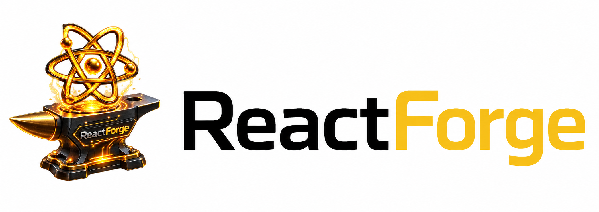

<div align="center">

  

  # ⚡ ReactForge
  ### **100 Hands-On React Machine Coding Challenges & Telemetry Laboratory**
  
  <p align="center">
    <strong>Master Frontend Machine Coding Interviews for SDE-1, SDE-2, and Senior / Staff Architect Roles.</strong>
  </p>

  <p align="center">
    <a href="https://reactforge.sanketkedare.com">
      
    </a>
    <a href="https://www.sanketkedare.com">
      
    </a>
    <a href="https://github.com/sanketkedare/ReactForge">
      
    </a>
  </p>

  <p align="center">
    
    
    
    
    
    
  </p>

  <br />

  <a href="#-quick-start">🚀 Quick Start</a> •
  <a href="#-curriculum-tracks-100-tasks">📚 Curriculum Tracks</a> •
  <a href="#-core-studio-laboratories">🔬 Studio Labs</a> •
  <a href="#-ai-interview-coach">🤖 AI Coach</a> •
  <a href="#-tech-stack--architecture">🛠️ Tech Stack</a> •
  <a href="#-author--contact">👨‍💻 Creator</a>

</div>

---

<br />

## 🌟 Executive Overview

**ReactForge** is an elite frontend developer practice lab and machine coding interview preparation environment. Engineered with **Next.js 16 Turbopack**, **React 19**, and a **permanent Obsidian Dark design system**, it delivers **100 practical hands-on tasks** ranging from fundamental state manipulators to distributed multi-tab synchronizers and 100,000-node virtualized data engines.

Every single challenge includes:
- 🧪 **Live Interactive Sandboxes**: Mutate component states in real-time with zero latency.
- 💻 **Dynamic Multi-File Source Code Viewer**: Deep-dive into typed production implementations.
- ⚡ **Automated Unit Test Suites**: Verify contracts, ARIA keyboard accessibility, and state immutability.
- 💡 **Interview Discussion Dossiers**: Targeted questions asked by tier-1 tech interviewers.
- 🤖 **AI Interview Coach**: AI guidance powered by Google Gemini 2.5 Flash with hints, code reviews, and solution breakdowns.

---

<br />

## 📚 Curriculum Tracks (100 Tasks Total)

<table>
  <thead>
    <tr>
      <th width="33%" align="center">
        <h3>🟢 Track 1: Junior / SDE-1</h3>
        <p><strong>40 Tasks • 15–30 Mins Target</strong></p>
      </th>
      <th width="33%" align="center">
        <h3>🟡 Track 2: Mid-Level / SDE-2</h3>
        <p><strong>35 Tasks • 30–45 Mins Target</strong></p>
      </th>
      <th width="34%" align="center">
        <h3>🟣 Track 3: Senior / System Design</h3>
        <p><strong>25 Tasks • 50–60 Mins Target</strong></p>
      </th>
    </tr>
  </thead>
  <tbody>
    <tr>
      <td valign="top">
        <sub>
          1. Password Generator<br />
          2. Todo List (CRUD)<br />
          3. Tic-Tac-Toe (Tiger vs Eagle)<br />
          4. Interactive Calculator<br />
          5. Star Rating Component<br />
          6. Image Carousel Slider<br />
          7. User Profile Editor<br />
          8. Drag Ball Physics<br />
          9. OTP 6-Digit Verification Box<br />
          10. Accessible Modal Dialog<br />
          11. Accordion Component<br />
          12. Stopwatch & Lap Timer<br />
          13. React Quiz & Score Engine<br />
          14. Step Counter with Multipliers<br />
          15. Color Contrast Checker (WCAG)<br />
          16. Dynamic Content Tabs<br />
          17. Smart Hover Tooltip<br />
          18. Digital & Analog Clock<br />
          19. Heart Burst Particle Animator<br />
          20. Real-time Word & Character Counter<br />
          21. BMI Health Calculator<br />
          22. Currency Converter API<br />
          23. Rock Paper Scissors AI<br />
          24. Card Memory Matching Game<br />
          25. Theme Context Provider<br />
          26. Collapsible Sidebar Navigation<br />
          27. Toast Notification Stack<br />
          28. Clipboard Snippet Vault<br />
          29. Password Strength Meter (zxcvbn)<br />
          30. E-Commerce Cart Counter<br />
          31. Animated Progress Bar<br />
          32. Tag Input & Chip Filter<br />
          33. Mobile Drawer Sheet<br />
          34. Personal Expense Tracker<br />
          35. Random Quote Generator<br />
          36. HEX / HSL Palette Generator<br />
          37. 3D Card Flip Showcase<br />
          38. Drag-and-Drop Sticky Notes<br />
          39. Live Interactive Poll Widget<br />
          40. Credit Card Input Masking
        </sub>
      </td>
      <td valign="top">
        <sub>
          41. Fetch Posts REST API & Cache<br />
          42. Custom useDebounce / useThrottle<br />
          43. Diwali Lights Pattern Animator<br />
          44. Fisher-Yates Gift Shuffler<br />
          45. Nested Threaded Comment Tree<br />
          46. Autocomplete Typeahead Search<br />
          47. Infinite Scroll Feed (IntersectionObserver)<br />
          48. Multi-Step Form Wizard<br />
          49. Drag & Drop File Uploader<br />
          50. Kanban Board DnD Workflow<br />
          51. Custom HTML5 Audio Player<br />
          52. Custom Video Player with Hotkeys<br />
          53. Paginated Data Table with Sorting<br />
          54. Custom useLocalStorage Hook<br />
          55. Custom useClickOutside Hook<br />
          56. Custom useMediaQuery Responsive Hook<br />
          57. Custom useFetch with AbortController<br />
          58. Custom useIntersectionObserver Hook<br />
          59. Dynamic SEO Breadcrumb Generator<br />
          60. Canvas Starfield Particle Physics<br />
          61. Live Markdown Previewer<br />
          62. Tree File Explorer (Nested Folders)<br />
          63. Dual-Panel Transfer List<br />
          64. Interactive Image Cropper (Canvas)<br />
          65. Dual-Handle Date Range Picker<br />
          66. Touch Swipe Carousel Slider<br />
          67. Virtualized Combobox Dropdown<br />
          68. Real-Time Weather Dashboard<br />
          69. GitHub User & Repository Search<br />
          70. Live Crypto Price Ticker Stream<br />
          71. Dynamic JSON Form Schema Builder<br />
          72. Half-Star Precision Rating<br />
          73. Multi-Select Checkbox Dropdown<br />
          74. Milestones Timeline Component<br />
          75. Dynamic QR Code Generator
        </sub>
      </td>
      <td valign="top">
        <sub>
          76. 100k Virtual Windowed Kanban<br />
          77. React Profiler & 600-Node Stress Lab<br />
          78. Event Pipeline (200 Pulses/s Canvas)<br />
          79. Multi-Tab Sync (BroadcastChannel)<br />
          80. State Battleground (Context vs RTK vs Zustand)<br />
          81. TanStack Query v5 Chaos Inspector<br />
          82. Time-Travel Undo/Redo (useHistory Engine)<br />
          83. Virtual Windowed Table (10,000 Rows)<br />
          84. 2D Virtual Masonry Grid Layout<br />
          85. Web Worker Heavy Prime Computation<br />
          86. React 19 Concurrency & useTransition<br />
          87. Optimistic UI Rollback Engine<br />
          88. Infinite 2D Pan/Zoom Canvas<br />
          89. Real-Time Whiteboard Drawing Canvas<br />
          90. Resizable Multi-Split Pane System<br />
          91. Rich WYSIWYG Content Editor<br />
          92. JavaScript AST Code Tokenizer<br />
          93. Keyboard Command Palette (⌘K Engine)<br />
          94. Mini Spreadsheet Formula Engine<br />
          95. Offline Sync Queue (IndexedDB + Dexie)<br />
          96. Audio Equalizer FFT AudioContext Analyzer<br />
          97. Micro-Frontend Module Federation<br />
          98. Enterprise Design System Playground<br />
          99. Real-Time WebSocket Multi-Room Chat<br />
          100. Core Web Vitals Live Telemetry Monitor
        </sub>
      </td>
    </tr>
  </tbody>
</table>

---

<br />

## 🔬 Core Studio Laboratories

<div align="center">

| Lab Module | Live Route | Architectural Highlights |
| :--- | :--- | :--- |
| **🚀 Real-Time Profiler Lab** | [`/profiler-lab`](https://reactforge.sanketkedare.com/profiler-lab) | 600-node matrix measuring React commit duration and re-render cascades with a live memoization switch. |
| **🌊 Event Pipeline Stream** | [`/event-pipeline`](https://reactforge.sanketkedare.com/event-pipeline) | 200 pulses/sec Canvas Oscilloscope comparing Raw, Debounce, Throttle, RAF 60Hz, and React 19 `useTransition`. |
| **📋 100k Virtual Kanban** | [`/virtual-kanban`](https://reactforge.sanketkedare.com/virtual-kanban) | 100,000 tasks virtualized with `@tanstack/react-virtual`, offline Dexie.js persistence, and network chaos rollback. |
| **💬 Threaded Recursive Tree** | [`/threaded-comments`](https://reactforge.sanketkedare.com/threaded-comments) | Deeply nested comments with sub-millisecond multi-tab IPC synchronization via `BroadcastChannel`. |
| **⚔️ State Battleground** | [`/state-battleground`](https://reactforge.sanketkedare.com/state-battleground) | Side-by-side shootout benchmarking **React Context**, **Redux Toolkit**, **Zustand**, and **Signals**. |
| **🔍 TanStack Query Inspector** | [`/query-inspector`](https://reactforge.sanketkedare.com/query-inspector) | Real-time visual cache explorer for Query Keys, stale/gc timers, and HTTP 500 error chaos injection. |

</div>

---

<br />

## 🤖 AI Interview Coach

ReactForge embeds a dedicated **AI Interviewer & Architecture Coach** powered by **Google Gemini 2.5 Flash**:

<p align="center">
  
</p>

- 💡 **Progressive Hint Engine**: Receive subtle algorithmic nudges without giving away full solutions.
- 📋 **Interview Evaluation & Grading**: Submit your code for immediate feedback on Big-O time complexity, React 19 best practices, and edge cases.
- 📐 **System Design Architectural Coaching**: Interactive Q&A for state normalization, memory management, and rendering pipelines.
- 🖥️ **Full-Screen Focus Mode**: Immersive terminal-style full-screen AI interview environment.

---

<br />

## 🛠️ Tech Stack & Architecture

```
ReactForge/
├── public/                       # High-res brand assets, icons & banners
├── src/
│   ├── app/                      # Next.js 16.3.2 App Router (SSG / SSR / API)
│   │   ├── (projects)/           # 100 Task Workbench Routes & Layouts
│   │   ├── (studio)/             # Advanced Studio Module Suites
│   │   ├── api/                  # Gemini AI & Dynamic Code Server Endpoints
│   │   ├── tasks/                # 100 Tasks Curriculum Directory
│   │   ├── layout.tsx            # Root Server Layout with Schema.org JSON-LD
│   │   ├── sitemap.ts            # Dynamic Native XML Sitemap (100 URLs)
│   │   ├── robots.ts             # Dynamic Search Engine Crawler Directives
│   │   ├── manifest.ts           # Web App PWA Manifest
│   │   ├── not-found.tsx         # Custom 404 Error Page
│   │   └── error.tsx             # Runtime React Error Boundary
│   ├── components/
│   │   ├── ai/                   # Gemini AI Drawers, Prompts & Fullscreen Chat
│   │   ├── common/               # GlobalFooter, ProjectHeader, CodeViewer
│   │   ├── studio/               # Profiler, Oscilloscope, Kanban, Battleground
│   │   └── Home/                 # Hero sections, Track Cards & Navbars
│   ├── context/                  # ProfilerContext & Telemetry Providers
│   ├── data/                     # learningProjects.ts (100 Challenges Catalog)
│   ├── lib/                      # Dexie DB, Tailwind utils, helpers
│   └── types/                    # TypeScript Data Contracts
├── next.config.ts                # Security headers, image optimization
├── tailwind.config.ts            # Obsidian dark theme design tokens
└── tsconfig.json                 # TypeScript 5.6 Strict Configuration
```

---

<br />

## ⚡ Quick Start

### Prerequisites
- **Node.js**: `v18.18.0` or higher
- **Package Manager**: `npm` or `pnpm`

### 1. Clone the Repository
```bash
git clone https://github.com/sanketkedare/ReactForge.git
cd ReactForge
```

### 2. Install Dependencies
```bash
npm install --legacy-peer-deps
```

### 3. Configure Environment Variables
Create a `.env.local` file in the project root:
```env
GEMINI_API_KEY=your_google_gemini_api_key_here
NEXT_PUBLIC_APP_URL=http://localhost:3002
```

### 4. Start Development Server (Port 3002)
```bash
npm run dev
```
> 🚀 Application will launch at: **[http://localhost:3002](http://localhost:3002)**

### 5. Production Build & Validation
```bash
npx tsc --noEmit        # Verify strict types (0 errors)
npm run build           # Compile SSG & static pages
npm start               # Start production server on port 3002
```

---

<br />

## 🌐 Production SEO & Performance

- **Authoritative Canonical URL**: `https://reactforge.sanketkedare.com`
- **Dynamic Sitemap**: [`/sitemap.xml`](https://reactforge.sanketkedare.com/sitemap.xml) mapping all 100 project routes with weighted priorities.
- **Dynamic Robots**: [`/robots.txt`](https://reactforge.sanketkedare.com/robots.txt) allowing search crawlers and guarding private API endpoints.
- **Schema.org Structured Data**: Pre-configured JSON-LD rich snippets for `WebSite`, `EducationalOrganization`, `SoftwareApplication`, `Course`, and `TechArticle`.
- **Social Sharing OpenGraph**: Pre-configured `1200x630` high-res preview cards for LinkedIn, Twitter, Discord, and WhatsApp.

---

<br />

## 👨‍💻 Author & Creator

<div align="center">

  ### **Crafted & Architected by Sanket Kedare**
  
  <p>
    <a href="https://www.sanketkedare.com" target="_blank">
      
    </a>
    <a href="https://github.com/sanketkedare" target="_blank">
      
    </a>
    <a href="https://www.linkedin.com/in/sanket-kedare-dev/" target="_blank">
      
    </a>
  </p>

  <p>
    <code style="background: rgba(245, 158, 11, 0.1); border: 1px solid rgba(245, 158, 11, 0.3); padding: 4px 10px; border-radius: 8px; font-weight: bold; color: #F59E0B;">
      &lt;<span style="color: #22D3EE;">S</span><span style="color: #FFFFFF;">K</span><span style="color: #C084FC;">/&gt;</span> Sanket Kedare
    </code>
  </p>

  <sub>© 2026 <strong>ReactForge</strong>. Built for developers preparing for high-impact frontend machine coding rounds. All rights reserved.</sub>

</div>
